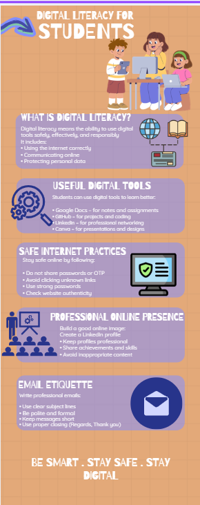
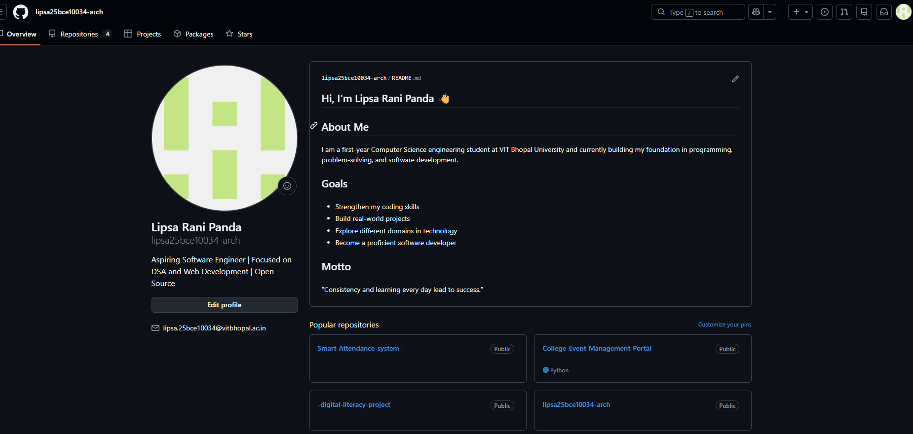
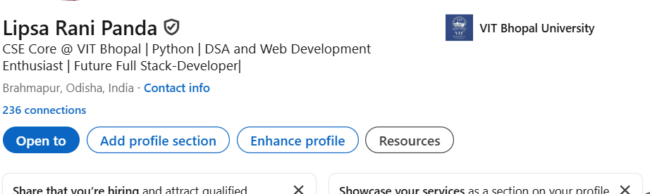
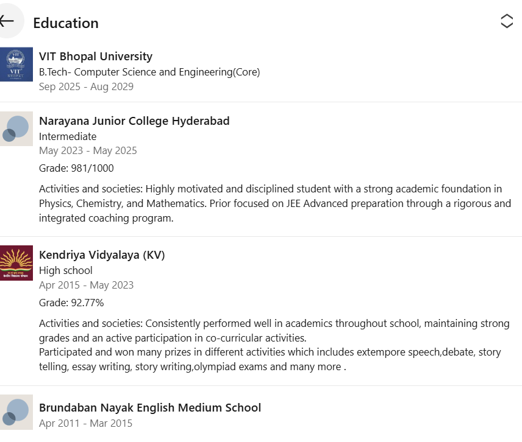
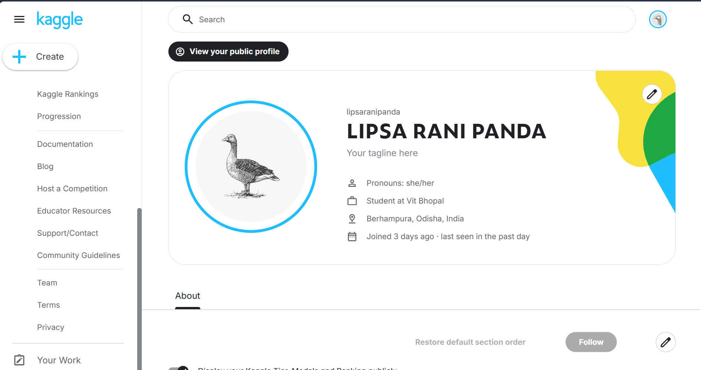
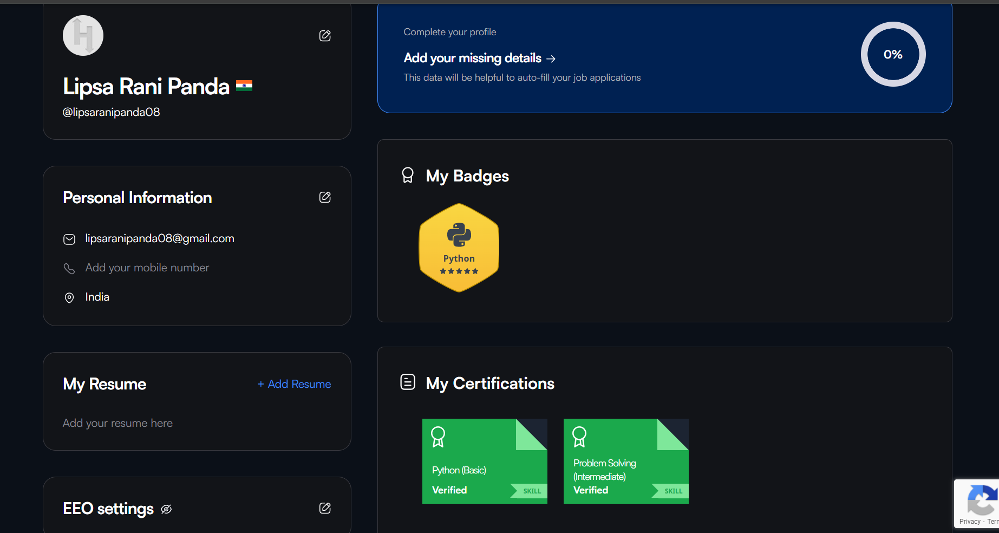
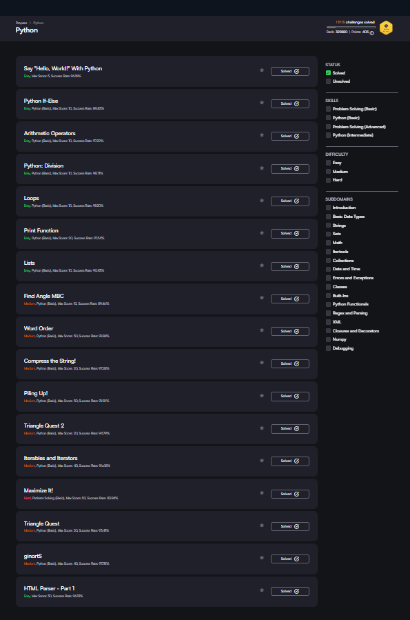
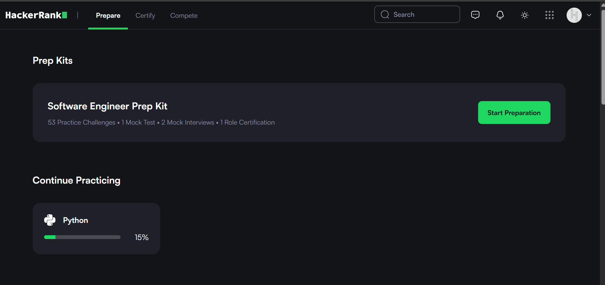

# -digital-literacy-project
## Student Details
Name: Lipsa Rani Panda 
Reg No: 25BCE10034 
Branch: Btech Computer Science Engineering(Core)
Year: 1st Year

## Project Overview
This project is created as part of the Digital Literacy course. The aim of this project is to understand the importance of digital skills, online platforms, professional communication, and cyber safety in today's world.

---

## Task Summary

### Task 1 – Infographic
Created a digital literacy awareness infographic using Canva. It covers topics like safe internet practices, digital tools, and professional online presence.

### Task 2 – Digital Portfolio
Created and updated profiles on platforms like GitHub ,Kaggle and  LinkedIn to build a professional online presence.
#### GitHub

#### LinkedIn

#### Kaggle

### Task 3 – Platforms

In this task, I explored coding practice and collaboration platforms to improve my digital skills.
## Part A – Coding Practice
I created an account on *HackerRank* and completed some  beginner-level challenge. This helped me understand basic coding concepts and improve problem-solving skills.

# Part B – Google Workspace Collaboration
I created a *Digital Literacy Awareness Quiz* using Google Forms with exactly 5 questions, including multiple-choice and short-answer questions. The responses were collected in a Google Sheet.

*Files:*
- [Google Form Screenshot](task-3-platforms/google-form-quiz.png)  
- [Google Sheet Response Screenshot](task-3-platforms/google-form-responses.png)

*Google Form Link:* [Click Here](https://forms.gle/Um6ZvcXZEHvEmvCE8)

### Task 4 – Email Etiquette

In this task, I created two professional emails:
1. Requesting an assignment submission extension
2. Inquiry regarding a summer internship opportunity

Both emails follow proper email etiquette, including clear subject lines, formal tone, structured content, and appropriate sign-offs.
I also created a social media do’s and don’ts checklist to promote responsible online behavior among students.

### Files Included:

### Learning Outcome:
This task helped me understand how to communicate professionally through emails and maintain responsible behavior on social media platforms.

### Task 5 – Cybercrime Awareness

In this task, I created a case study on UPI payment fraud and a prevention checklist to spread awareness about online safety.

### Files:
- [Case Study](task-5-cybercrime/casestudy.md)
- [Prevention Checklist](task-5-cybercrime/prevention-checklist.md)

---

## Conclusion
This project helped me understand the importance of digital literacy, online safety, and professional communication. It also improved my knowledge of useful digital platforms.

